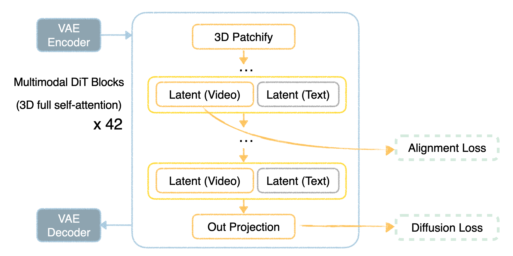
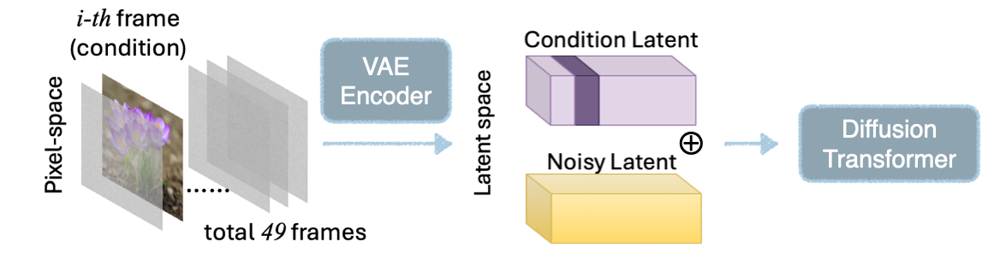
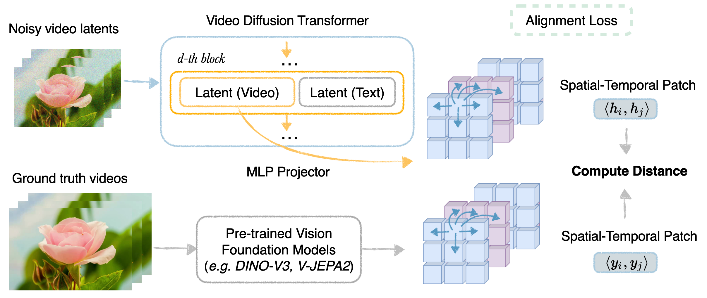



## Overview
Long-range coherence is a key problem in image to video generation. Unlike text-to-video cases, conditioning on an input image imposes the greater challenge of faithfully maintaining image content, often requiring a model to understand semantics and geometry in order to avoid unnatural morphing and sudden substitutions. Advancing long-range coherence to handle hundreds or thousands of frames would unlock new applications in world modeling, simulation, and interactive agents. 

Some methods aim to extend temporal duration by stitching short clips together---often autoregressively---while trying to maintain the alignment of subjects and scenes<d-cite key="henschel2025streamingt2v"></d-cite><d-cite key="zhang2025packing"></d-cite>. This works well when the clips are self-consistent, but it can amplify compounding mistakes when they are not. 

A potential alternative would be to generate a fast-forward (i.e., timelapse) version of long video as a single clip, and then to use inbetweening and interpolation to create finer temporal details. This approach is becoming more feasible thanks to video generation backbones that can produce clips with around 50--90 frames in a single pass. 

This raises the question: Can existing image-to-video models generate convincing long-horizon content within a single clip? To study this, we focus on generating timelapse videos [ADD EXAMPLE FIGURES], which compress hours or days of change (plant growth, dough proofing, melting, etc.) into seconds. Subject appearance and geometry can evolve substantially during a timelapse video, so success requires the ability to model physically plausible transitions and stable long-horizon dependencies. This makes image-to-timelapse generation a convenient benchmark for improving long-horizon consistency in general. 

We show that current models often fail when generating timelapse clips, and we introduce an alignment technique that leads to improvements. Our technique is called first-order representation alignment (dREPA), and it builds on the representation alignment scheme of Yu et al.<d-cite key="yu2024representation"></d-cite> and Zhang et al.<d-cite key="zhang2025videorepa"></d-cite>. It is a simple training-time regularizer that improves subject consistency in timelapse videos across a range of artistic and photo-realistic styles. Alignment with dREPA can help generate content that substitutes for the laborious process of capturing real timelapse videos.

### How do existing methods fail?

There has been relatively little work on generating timelapse videos. The closest we know is MagicTime<d-cite key="yuan2025magictime"></d-cite>, a text-to-video method that turns detailed prompts into short 16-frame clips. It is effective for stylized, cartoon-like outputs but is not designed for image conditioning or photorealistism.

We tested some current image-to-video models on timelapse generation, and we observed two main types of failures:

1. <strong>Lack of shape dynamics</strong>:
The generated content is largely static, failing to realize continuous deformations like a blooming flower or rising bread.

2. <strong>Lack of subject consistency</strong>:
There are sudden appearance shifts,  with abrupt, irrelevant substitutions, even in a strong model like Veo-3.

<section class="block">
  <h3>Failure case 1. Limited Morphing Degree (MD)</h3>
  

    <figure>
      <video src="/assets/videos/consistI2V.mp4" autoplay loop muted playsinline></video>
      <figcaption>ConsistI2V</figcaption>
    </figure>
    <figure>
      <video src="/assets/videos/hunyuan_peony.mp4" autoplay loop muted playsinline></video>
      <figcaption>Hunyuan Video</figcaption>
    </figure>
  

</section>

<section class="block">
  <h3>Failure case 2. Lack of Subject Consistency (SC)</h3>
  

    <figure>
      <video src="/assets/videos/veo3_almond.mp4" autoplay loop muted playsinline></video>
      <figcaption>Veo3</figcaption>
    </figure>
    <figure>
      <video src="/assets/videos/cog_peony.mp4" autoplay loop muted playsinline></video>
      <figcaption>CogVideoX (base)</figcaption>
    </figure>
  

</section>

 
These failures highlight the core challenge of timelapse (and long-range video) generation: _achieving meaningful progression over time while preserving subject identity and scene layout_.

### Our approach
We show that we can improve both the morphing degree and preserve subject consistency with the right training-time regularization, even with limited data. 

<section class="block">
  <h3>Ours SC&uarr; MD&uarr;</h3>
  

    <figure>
      <video src="/assets/videos/almond.mp4" autoplay loop muted playsinline></video>
      <figcaption></figcaption>
    </figure>
    <figure>
      <video src="/assets/videos/repa_peony.mp4" autoplay loop muted playsinline></video>
      <figcaption></figcaption>
    </figure>
  

</section>

 
Inspired by REPA~\cite{yu2024representation} and following VideoREPA \cite{zhang2025videorepa}, we introduce a first-order representation alignment (dREPA) objective that enhances the model's ability to learn complex spatio-temporal dynamics. A key advantage of dREPA is that it is only applied as training-time regularization and does not require additional inference overhead.

Our approach also enjoys reduced reliance on detailed text prompts; a generic description is often sufficient. Furthermore, recognizing that a single image captures just one arbitrary moment in a longer process (like a photo of a plant in its lifecycle), we extend the framework to support \textbf{any-frame} conditioning, allowing video generation to condition from any point in a sequence and improves the morphing degree of the generated videos.

We show some representative examples here (with their conditioning keyframe).

<figure style="max-width: 960px; margin: 0 auto; text-align: center;">
  <video
    src="/assets/videos/output_cropped.mp4"
    autoplay
    muted
    loop
    playsinline
    style="width:100%; height:auto; display:block; border-radius:0px; background:#000;">
    Sorry—your browser doesn’t support embedded videos.
  </video>
  <figcaption style="margin-top:8px; font-size:0.95rem; color:#666;">
    (Ours) Anyframe to timelapse video generation
  </figcaption>
</figure>

## Backbone
Given the limited amount of domain-specific data, we finetune from a pretrained video generation model, CogVideoX-5B-I2V \cite{yang2024cogvideox}. At a high level, the backbone is a latent diffusion transformer consists of 42 multimodal transformer layers, each applying self-attention over a concatenation of video latents and text-prompt latents. During training, the model predicts the clean latent estimate, $\hat{x}_0$ for all frames. (This differs from models that predict noise $\hat{\epsilon}$ or velocity $\hat{v}$, but the objectives are equivalent up to loss reweighting \cite{gao2025diffusionmeetsflow}.)

CogVideoX-5B-I2V conditions on the first frame and produces 49 frames at 480×720 resolution through the diffusion process. The 3D causal VAE compresses the spatial dimensions by a factor of 16 and the temporal dimension by a factor of 4 (with the first frame exempt from temporal compression).

## Anyframe Conditioning
For the backbone model, first-frame conditioning is implemented by passing the conditioning image through the 3D VAE (which supports inputs of either a single frame or $1 + 4N$ frames, for integer $N$). The resulting latent representation of the first frame is then padded with zeros across the remaining 12 latent frames.

To extend this setup to any-frame conditioning and consider the full 49-frame video in pixel space with the $i$-th frame as the conditioning image. We replace the $i$-th frame with the conditioning image and mask all other frames with zero-mean Gaussian noise of variance 0.07. Empirically, we observed that directly masking the remaining frames with zeros leads to poor VAE reconstruction quality, likely because the VAE was not trained under such inputs. By contrast, replacing the unconditioned frames with low-variance Gaussian noise provides more stable reconstructions, allowing us to reuse the pretrained 3D VAE without retraining.

During training, we randomly select the conditioning frame $i$ and use the corresponding ground-truth frame from the video for conditioning. Additionally, we introduce a \textbf{fallback mechanism}: when the selected conditioning frame is the first frame, the remaining latents are zero-padded. This ensures consistency with the original pretraining setup of CogVideoX-5B-I2V and stabilizes training.

Extending first-frame to \emph{any-frame} conditioning allows the model to generate an entire timelapse from a single image taken at any point in the lifecycle, while preserving a sufficient degree of physical morphing across time. 

## First-order Representation Alignment (dREPA)

### Intuitions
A critical limitation of existing video diffusion models is their lack of \textit{intra-clip consistency}, as demonstrated in our preliminary experiments. We hypothesize that this limitation could stem from the diffusion loss formulation.

Consider the typical regression-style diffusion loss computes the L2 distance between predicted clean frames and ground-truth frames at each timestep, averaging over spatial locations and across all frames. This formulation primarily penalizes 0th-order pattern and often ignores temporal dynamics.

A toy 1D example can intuitively illustrate the issue. Consider three signals compared against a ground truth over four frames $f_0$ to $f_3$:

1. A shifted version of the ground truth.

2. A zigzagging variation around the ground truth.

3. A partial match for the first two timesteps that diverges thereafter.

Despite their clear differences in temporal behavior, all three are treated equally under per-timestep aggregated regression loss. In practice, the shifted signal should be preferred because it better preserves the first-order dynamics of the ground truth. This motivates additional loss function that specifically target first-order spatio-temporal pattern.

### Main method
To capture first-order behavior, we align the spatial-temporal relations of the generative model’s latent features with those extracted from pretrained Vision Foundation Models (VFMs). Inspired by image generation representation alignment (REPA) \cite{yu2024representation} and similar to VideoREPA \cite{zhang2025videorepa}, we propose **dREPA** (derivative REPA), which regularizes pretrained video diffusion models without altering their core architecture.

* From the **pixel-space, ground-truth video**, we extract dense spatio-temporal features using a vision foundation model such as V-JEPA2 or DINO-v3. We then compute patchwise similarities between all spatio-temporal patch pairs $y_i, y_j$ across the $N$ patches with $i \neq j$.
* For the **generative model**, we apply a lightweight MLP projector that maps the generative model’s latents (at an intermediate DiT block) into the VFM feature space with the same spatio-temporal resolution. We then compute pairwise cosine similarities across all patches $h_i, h_j$.

The alignment loss is computed as the distance between patch-wise similarities:

$$
\mathcal{L}_{\text{repa}}
= \frac{1}{N(N-1)} \sum_{i \ne j}
\big( \langle h_i, h_j \rangle - \langle y_i, y_j \rangle \big)^2
$$

where the features are \(\ell_2\)-normalized when computing the inner products.

### Practical Considerations and Findings
Following prior work \cite{zhang2025videorepa}, we align features from layer 17 of the backbone CogVideoX. Through ablations we also find that:

* **Loss function**: Using L2 distance for repa loss yields better generation quality than L1 loss.
* **Choice of VFM**: V-JEPA2 or per-frame DINO-v3 features outperform VideoMAEv2 features.
* **Alignment**: Directly aligning 0th-order features (as in standard REPA \cite{yu2024representation}) degrades pretrained models, whereas dREPA’s first-order alignment is more stable.

Also note that the MLP projector is only used during training to compute the alignment loss. At inference, it is removed entirely, leaving the backbone architecture unchanged and incurring no additional runtime cost.

## Experiments
### Ablations
To assess the effectiveness of dREPA, we finetune the CogVideoX-5B-I2V backbone for anyframe conditioning under two settings: 

1. Without dREPA (baseline finetuning)

2. With dREPA (our proposed method)

Both settings use identical random seeds, training iterations, and inference conditions. For fair comparison, we fix the same initial noise and random seeds during generation.

When trained without dREPA, the model frequently produces discontinuities in a single generated clip—for example, sudden introduction of new content, as seen in the tulip case. In contrast, finetuning with dREPA leads to temporally smoother sequences with more physically realistic morphing behavior.

<!-- Ablations grid: 4 rows × 2 columns -->

  

    
finetuning only

    
+ REPA

  

  <!-- Define your 4 rows (left = finetuning, right = +REPA). 
       Replace file names with your actual video files. -->
  

  

    
      
      
      

      <!-- Left column: finetuning only -->
      <figure>
        <video muted autoplay loop playsinline preload="metadata"
               src="/assets/videos/{{ left }}"></video>
        <!-- Optional per-video caption; remove if not needed -->
        <!-- <figcaption>video {{ forloop.index }} (finetuning only)</figcaption> -->
      </figure>

      <!-- Right column: + REPA -->
      <figure>
        <video muted autoplay loop playsinline preload="metadata"
               src="/assets/videos/{{ right }}"></video>
        <!-- <figcaption>video {{ forloop.index }} (+ REPA)</figcaption> -->
      </figure>
    
  

### Comparison

The benefits of dREPA are especially pronounced for out-of-distribution inputs such as paintings. Although the model never observes artistic paintings during training, dREPA-regularized models generalize well, producing consistent and realistic blooming sequences from, e.g., sunflower oil paintings. On these artistic domains, our approach even surpasses several closed-source commercial models (e.g., Google Veo3, Runway Gen4) in terms of subject consistency and faithful preservation of the painting texture.

<!-- ===== 2 rows × 3 columns comparison grid ===== -->

  

    
Veo3

    
Gen4

    
Ours

  

  

    <!-- Row 1 -->
    <figure>
      <video muted autoplay loop playsinline preload="metadata"
             src="/assets/videos/veo3_sunflower.mp4"></video>
    </figure>
    <figure>
      <video muted autoplay loop playsinline preload="metadata"
             src="/assets/videos/gen4_sunflower.mp4"></video>
    </figure>
    <figure>
      <video muted autoplay loop playsinline preload="metadata"
             src="/assets/videos/repa_sunflower.mp4"></video>
    </figure>

    <!-- Row 2 -->
    <figure>
      <video muted autoplay loop playsinline preload="metadata"
             src="/assets/videos/veo3_monet.mp4"></video>
    </figure>
    <figure>
      <video muted autoplay loop playsinline preload="metadata"
             src="/assets/videos/gen4_monet.mp4"></video>
    </figure>
    <figure>
      <video muted autoplay loop playsinline preload="metadata"
             src="/assets/videos/repa_monet.mp4"></video>
    </figure>
  

<!-- ===== End comparison grid ===== -->

### More results with REPA

Our model works seamlessly on diverse input sources, including iPhone-captured photos and online images. Conditioning can be applied at arbitrary frames, from which we generate the entire timelapse sequence.

iPhone captured photos

  <figure>
    <video muted autoplay loop playsinline preload="metadata"
           src="/assets/videos/photo30.mp4"></video>
  </figure>
  <figure>
    <video muted autoplay loop playsinline preload="metadata"
           src="/assets/videos/photo24.mp4"></video>
  </figure>
  <figure>
    <video muted autoplay loop playsinline preload="metadata"
           src="/assets/videos/photo8.mp4"></video>
  </figure>

Internet images

  <figure>
    <video muted autoplay loop playsinline preload="metadata"
           src="/assets/videos/cherry_tree.mp4"></video>
  </figure>
  <figure>
    <video muted autoplay loop playsinline preload="metadata"
           src="/assets/videos/anemone.mp4"></video>
  </figure>
  <figure>
    <video muted autoplay loop playsinline preload="metadata"
           src="/assets/videos/carnation.mp4"></video>
  </figure>

Adding Camera Motion

  <figure>
    <video muted autoplay loop playsinline preload="metadata"
           src="/assets/videos/camera_rotation.mp4"></video>
  </figure>
  <figure>
    <video muted autoplay loop playsinline preload="metadata"
           src="/assets/videos/Cherry_zoomin.mp4"></video>
  </figure>
  <figure>
    <video muted autoplay loop playsinline preload="metadata"
           src="/assets/videos/zoomin1.mp4"></video>
  </figure>

Baking scenes

  <figure>
    <video muted autoplay loop playsinline preload="metadata"
           src="/assets/videos/bake2.mp4"></video>
  </figure>
  <figure>
    <video muted autoplay loop playsinline preload="metadata"
           src="/assets/videos/bake7.mp4"></video>
  </figure>
  <figure>
    <video muted autoplay loop playsinline preload="metadata"
           src="/assets/videos/bake4.mp4"></video>
  </figure>

### Generalization to different artistic styles

Beyond real photos, the model generalizes well to different artistic styles and requires only simple text prompt such as “timelapse of flower blooming”. We demonstrate results across watercolor, anime, and impressionist paintings, showing the benefit of dREPA regularized training.

<!-- Experiments video grid (2x2) -->

  <figure>
    <video muted autoplay loop playsinline preload="metadata"
      src="/assets/videos/ghibli1.mp4"></video>
    <figcaption>Studio Ghibli</figcaption>
  </figure>
  <figure>
    <video muted autoplay loop playsinline preload="metadata"
      src="/assets/videos/flower1.mp4"></video>
    <figcaption>Yun Lanxi, Flower Painting (Qing Dynasty)</figcaption>
  </figure>
  <figure>
    <video muted autoplay loop playsinline preload="metadata"
      src="/assets/videos/asawa2.mp4"></video>
    <figcaption>Ruth Asawa, Flowers VII (1965)</figcaption>
  </figure>
  <figure>
    <video muted autoplay loop playsinline preload="metadata"
      src="/assets/videos/met5.mp4"></video>
    <figcaption>Henri Fantin-Latour, Roses and Lilies (1888)</figcaption>
  </figure>
    <figure>
    <video muted autoplay loop playsinline preload="metadata"
      src="/assets/videos/sanyu1.mp4"></video>
    <figcaption>Sanyu, Chrysanthemums (1950s)</figcaption>
  </figure>
  <figure>
    <video muted autoplay loop playsinline preload="metadata"
      src="/assets/videos/almond.mp4"></video>
    <figcaption>Vincent van Gogh, Almond Blossom (1890)</figcaption>
  </figure>
  <figure>
    <video muted autoplay loop playsinline preload="metadata"
      src="/assets/videos/matisse.mp4"></video>
    <figcaption>Henri Matisse, Anemones in Vase (1924)</figcaption>
  </figure>
  <figure>
    <video muted autoplay loop playsinline preload="metadata"
      src="/assets/videos/dali_rose.mp4"></video>
    <figcaption>Salvador Dali, Meditative Rose (1958)</figcaption>
  </figure>

## Limitations and Future Work

Despite these improvements, the model still exhibits some limitations:

- Complex backgrounds: Most training videos feature  simple backgrounds. Conditioning on images with cluttered or dynamic backgrounds sometimes leads to unstable generations.

- Limited physical accuracy: Due to dataset scarcity, certain subjects (e.g., blue hydrangea) are not always rendered with correct physical dynamics.

  <figure>
    <video muted autoplay loop playsinline preload="metadata"
           src="/assets/videos/ghibli3_bg.mp4"></video>
  </figure>
  <figure>
    <video muted autoplay loop playsinline preload="metadata"
           src="/assets/videos/photo1_bg.mp4"></video>
    <figcaption>Some failure cases</figcaption>
  </figure>
  <figure>
    <video muted autoplay loop playsinline preload="metadata"
           src="/assets/videos/photo17_bg.mp4"></video>
  </figure>

For future work, we aim to extend the conditioning mechanism to multiple keyframes, enabling users to provide sparse temporal anchors from which the model can interpolate the full timelapse sequence.

## Takeaways
In this blog, we explored how to extend CogVideoX-5B-I2V for any-frame conditioning and introduced dREPA, a lightweight alignment strategy that improves temporal consistency in video diffusion models. Our key findings are:

1. Existing first-frame conditioning I2V models can be easily **extended to any-frame conditioning**, enabling generation from arbitrary starting points.

2. **dREPA regularization** improves subject consistency and the physical realism of temporal dynamics with limited finetuning data.

3. The method **generalizes beyond training data**, producing high-quality results on different artistic styles and out-of-distribution domains.

Overall, dREPA shows the value of aligning **first-order spatiotemporal representations** rather than relying solely on framewise losses. This opens the door to more controllable, physically consistent video generation systems, with applications from physics-grounded modeling ("world models") to digital art.

## Appendix - Dataset Curation
Our training dataset consists of a mixture of the open-source ChronoMagic-ProH dataset \cite{yuan2024chronomagic} and an internal dataset from Apple. Our goal is to curate timelapse-style content where objects undergo gradual, long-horizon changes, such as plant growth or baking process.

**Curation pipeline**

1. *Keyword and metadata filtering* We begin with caption and metadata search to select candidate videos in the plant and food categories that are tagged as timelapse or contain related descriptors.
2. *Content verification*. For each candidate video, we sample a five-frame snapshot spanning its duration. We then query a multimodal LLM (e.g., Gemini-2.5-pro) to verify that the video actually depicts a timelapse-like process, ensuring that the subject remains consistent while undergoing meaningful change.
3. *Deduplication and cleanup*. Near-duplicate and low-quality clips are removed to ensure data quality.

**Final corpus**: After preprocessing, we collect around 3.8k unique timelapse videos. From each, we extract subclips at three different time intervals, yielding around 11k short clips in total for training, each with paired text caption.

## Acknowledgements

We thank Todd Zickler for helpful discussions.

